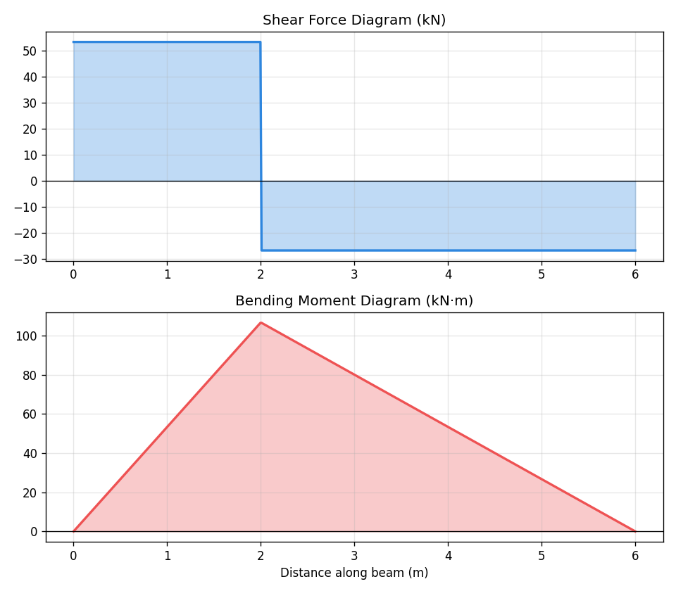

# 🏗️ PythonForStructures

**Real structural engineering tools. Built in Python. ~15 lines each.**

This repo is for civil and structural engineers who want to code — but don't know where to start.

Every tool here solves a real problem you already understand as an engineer.  
No iris flower datasets. No generic tutorials.  
Just structural engineering, written in Python.

---

## 👷 Who This Is For

- Newly graduated civil/structural engineers
- Engineers who want to automate repetitive analysis tasks
- Anyone who has ever thought *"there has to be a faster way to do this"*

No prior programming experience required. If you understand the engineering, you'll understand the code.

---

## 🧰 The Toolkit

| # | Tool | Concepts | Status |
|---|------|----------|--------|
| 01 | [Shear & Moment Diagrams](./01-shear-moment-diagram/) | NumPy, Matplotlib, Statics | ✅ Ready |
| 02 | ACI Load Combinations Generator | Conditionals, DataFrames | 🔜 Coming |
| 03 | Beam Deflection Plotter | Integration, Visualization | 🔜 Coming |
| 04 | Section Property Calculator | NumPy, Geometry | 🔜 Coming |
| 05 | Rebar Weight Estimator | Pandas, Bar Schedules | 🔜 Coming |
| 06 | Reinforcement Ratio Checker | Code Compliance, Logic | 🔜 Coming |
| 07 | Wind Load Calculator (ASCE 7) | Functions, Standards | 🔜 Coming |
| 08 | Concrete Strength Data Analyzer | Statistics, SciPy | 🔜 Coming |
| 09 | Sensor Data Cleaner | Pandas, Real Monitoring Data | 🔜 Coming |
| 10 | Earthquake Response Plotter | Signal Processing, Ground Motion | 🔜 Coming |
| 11 | Simple FEM Truss Solver | Matrix Methods, Linear Algebra | 🔜 Coming |

New tools are added regularly. Follow along on LinkedIn to get each one as it drops.

---

## 🚀 Getting Started

**Requirements:**
```bash
pip install numpy matplotlib pandas scipy
```

**Run any tool:**
```bash
cd 01-shear-moment-diagram
python beam_shear_moment.py
```

Each tool folder contains:
- The Python script (ready to run)
- A README explaining the engineering and the code
- A sample output image

---

## 📐 Example Output — Tool #01

Shear & moment diagrams for a simply supported beam with a point load.  
Change 3 numbers. Get both diagrams instantly.

```python
L = 6.0      # span length (m)
P = 50.0     # point load (kN)
a = 2.0      # load position from left support (m)
```



---

## 🧠 The Philosophy

These tools are not meant to replace structural software like ETABS or ABAQUS.

They are meant to show you that the engineering you already know  
can be expressed in code — and that code makes you dramatically faster.

Once you can automate a shear diagram, you can automate a load case study.  
Once you can automate a load case study, you can train a model to predict structural behavior.

The gap between where you are and where AI-assisted structural engineering is going  
is closed 15 lines at a time.

---

## 📬 Follow the Series

Each tool in this repo is released alongside a LinkedIn post explaining the engineering logic, the Python approach, and what to build next.

🔗 [Follow on LinkedIn](https://www.linkedin.com/in/abdullah-sagheer) to get each tool as it drops.

Use **#PythonForStructures** to share your results or ask questions.

---

## 📄 License

MIT License — free to use, modify, and share.  
See [LICENSE](./LICENSE) for details.

---

*Built by [Abdullah M. Sagheer](https://www.linkedin.com/in/abdullah-sagheer) — Structural Engineer | AI & ML for Infrastructure | UAE*
