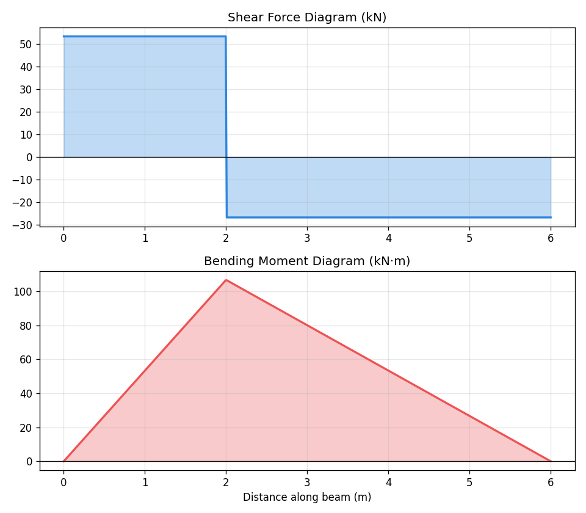
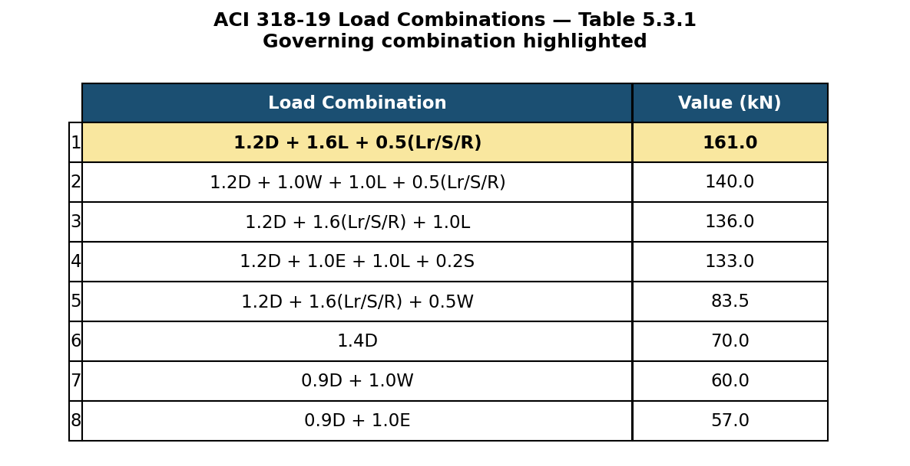
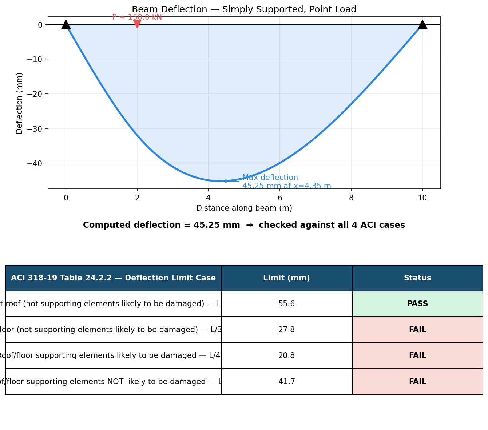
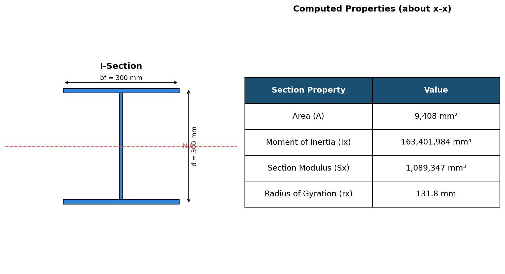
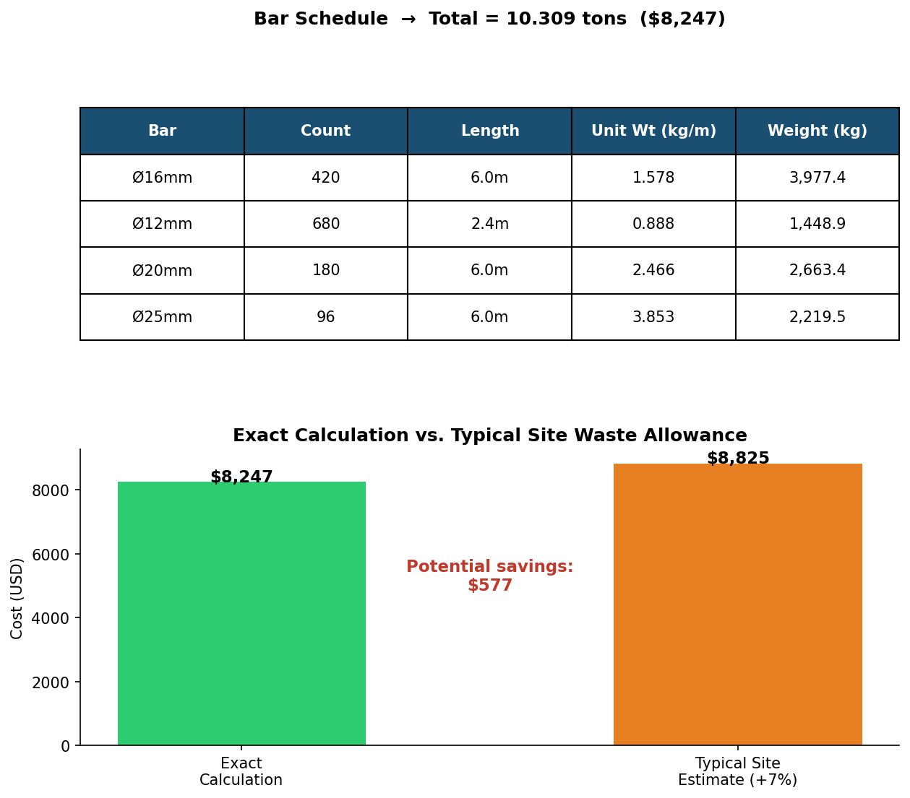
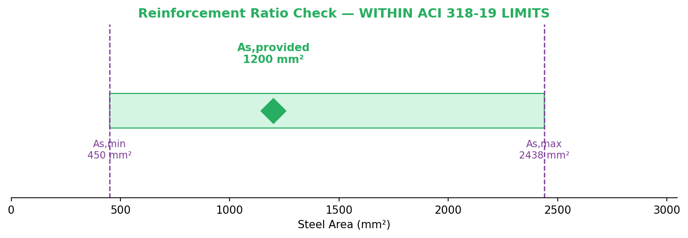

# 🏗️ PythonForStructures

**Real structural engineering tools. Built in Python. ~15 lines each.**

This repo is for civil and structural engineers who want to code — but don't know where to start.

Every tool here solves a real problem you already understand as an engineer.  
No iris flower datasets. No generic tutorials.  
Just structural engineering, written in Python.

---

## 👷 Who This Is For

- Newly graduated civil/structural engineers
- Engineers who want to automate repetitive analysis tasks
- Anyone who has ever thought *"there has to be a faster way to do this"*

No prior programming experience required. If you understand the engineering, you'll understand the code.

---

## 🧰 The Toolkit

| # | Tool | Concepts | Status |
|---|------|----------|--------|
| 01 | [Shear & Moment Diagrams](./01-shear-moment-diagram/) | NumPy, Matplotlib, Statics | ✅ Ready |
| 02 | [ACI Load Combinations Generator](./02-load-combinations/) | Pandas, Dictionaries, Table Rendering | ✅ Ready |
| 03 | [Beam Deflection Checker (ACI 318-19)](./03-beam-deflection/) | NumPy, ACI Serviceability Limits | ✅ Ready |
| 04 | [Section Property Calculator](./04-section-properties/) | NumPy, Parallel Axis Theorem | ✅ Ready |
| 05 | [Rebar Weight & Cost Estimator](./05-rebar-estimator/) | NumPy, Cost Analysis | ✅ Ready |
| 06 | [Reinforcement Ratio Checker](./06-reinforcement-ratio/) | ACI 318-19, Strain Compatibility | ✅ Ready |
| 07 | Wind Load Calculator (ASCE 7) | Functions, Standards | 🔜 Coming |
| 08 | Concrete Strength Data Analyzer | Statistics, SciPy | 🔜 Coming |
| 09 | Sensor Data Cleaner | Pandas, Real Monitoring Data | 🔜 Coming |
| 10 | Earthquake Response Plotter | Signal Processing, Ground Motion | 🔜 Coming |
| 11 | Simple FEM Truss Solver | Matrix Methods, Linear Algebra | 🔜 Coming |

New tools are added regularly. Follow along on LinkedIn to get each one as it drops.

---

## 🚀 Getting Started

**Requirements:**
```bash
pip install numpy matplotlib pandas scipy
```

**Run any tool:**
```bash
cd 01-shear-moment-diagram
python beam_shear_moment.py
```

Each tool folder contains:
- The Python script (ready to run)
- A README explaining the engineering and the code
- A sample output image

---

## 📐 Example Output — Tool #01

Shear & moment diagrams for a simply supported beam with a point load.  
Change 3 numbers. Get both diagrams instantly.

```python
L = 6.0      # span length (m)
P = 50.0     # point load (kN)
a = 2.0      # load position from left support (m)
```



## 📐 Example Output — Tool #02

All 8 ACI 318-19 load combinations (Table 5.3.1), ranked and rendered as a clean table with the governing case highlighted.

```python
D  = 50.0    # Dead Load
L  = 30.0    # Live Load
Lr = 10.0    # Roof Live Load
S  =  5.0    # Snow Load
W  = 15.0    # Wind Load
E  = 12.0    # Earthquake Load
```



*Based on ACI 318-19, Table 5.3.1. Always verify against your project's applicable code edition and local amendments.*

---
## 📐 Example Output — Tool #03

Computes the deflected shape of a simply supported beam under a point load, then checks the maximum deflection against all 4 ACI 318-19 Table 24.2.2 serviceability limits — PASS/FAIL rendered automatically.

```python
L  = 6.0        # span length (m)
P  = 50.0       # point load (kN)
a  = 2.0        # load position from left support (m)
E  = 200e6      # modulus of elasticity (kN/m^2)
I  = 0.0002     # moment of inertia (m^4)
```



*Checks total computed deflection against ACI 318-19 Table 24.2.2. A full ACI deflection design also accounts for effective (cracked) moment of inertia and separates immediate vs. long-term deflection — this tool is a fast serviceability screening check, not a substitute for the complete code procedure.*

## 📐 Example Output — Tool #04

Computes area, moment of inertia, section modulus, and radius of gyration for an I-section — verified by hand against the parallel axis theorem.

```python
bf = 150     # flange width (mm)
tf = 12      # flange thickness (mm)
d  = 300     # overall depth (mm)
tw = 8       # web thickness (mm)
```



---

## 📐 Example Output — Tool #05

Calculates exact rebar tonnage and cost from a bar schedule, then compares it against a typical site waste allowance — showing the real dollar impact of precise calculation.

```python
bar_schedule = [
    {"dia": 16, "count": 420, "length": 6.0},
    {"dia": 12, "count": 680, "length": 2.4},
    {"dia": 20, "count": 180, "length": 6.0},
    {"dia": 25, "count": 96,  "length": 6.0},
]
```



*Unit weights verified against standard steel rebar tables (density = 7850 kg/m³). Waste allowance shown is illustrative — actual site allowances vary by contractor and project.*

## 📐 Example Output — Tool #06

Checks provided reinforcement against both ACI 318-19 limits in one pass: the minimum steel requirement (ACI 9.6.1.2, prevents brittle cracking failure) and the maximum steel limit (ACI 9.3.3.1, tension-controlled strain requirement, ensures ductile yielding before concrete crushes).

```python
fc  = 28.0     # concrete strength (MPa)
fy  = 420.0    # steel yield strength (MPa)
bw  = 300.0    # beam width (mm)
d   = 450.0    # effective depth (mm)
As_provided = 1200.0   # steel area provided (mm^2)
```



*Maximum reinforcement uses the standard tension-controlled strain-limit derivation (εt ≥ 0.005) for beams with low axial load. Compression reinforcement, T-beams, and axial load interaction require additional checks beyond this script.*


## 🧠 The Philosophy

These tools are not meant to replace structural software like ETABS or ABAQUS.

They are meant to show you that the engineering you already know  
can be expressed in code — and that code makes you dramatically faster.

Once you can automate a shear diagram, you can automate a load case study.  
Once you can automate a load case study, you can train a model to predict structural behavior.

The gap between where you are and where AI-assisted structural engineering is going  
is closed 15 lines at a time.

---

## 📬 Follow the Series

Each tool in this repo is released alongside a LinkedIn post explaining the engineering logic, the Python approach, and what to build next.

🔗 [Follow on LinkedIn](https://www.linkedin.com/in/abdullah-sagheer) to get each tool as it drops.

Use **#PythonForStructures** to share your results or ask questions.

---

## 📄 License

MIT License — free to use, modify, and share.  
See [LICENSE](./LICENSE) for details.

---

*Built by [Abdullah M. Sagheer](https://www.linkedin.com/in/abdullah-sagheer) — Structural Engineer | AI & ML for Infrastructure | UAE*
